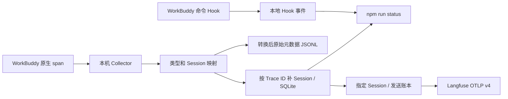

# WorkBuddy Langfuse Plugin

当前版本 **0.2.0 / 第二阶段 A：元数据与 Token 上报**。第一阶段的桌面插件加载与子 span Session 问题已修复并通过真实验收；第二阶段 A 已完成本机 Langfuse 的两轮实际写入与 Token 对照。

| 阶段 | 交付 | 状态 |
|---|---|---|
| 1 | 原生链路、Session 关联、持久插件与 Hook 诊断 | 通过，修复版本 v0.1.1-phase1 |
| 2A | 指定 Session 上传、实际 Token 对照、重复执行跳过已发送记录 | 通过，版本 v0.2.0-phase2a |
| 2B | 可选正文采集、工具输入输出、缓存用量与费用核验 | 待实现；当前正文仍关闭、费用未知 |
| 3 | 自动增量上报、运行状态、完整恢复流程 | 待实现 |

验收记录：[第一阶段修复](docs/acceptance-2026-09-08.md)、[第二阶段 A](docs/acceptance-phase2a-2026-09-08.md)。[第二阶段操作步骤](docs/phase-2.md)包含配置、上传预览和真实入库核验。上传必须指定 Session 并加 `--send`，没有自动上传或历史回灌。

## 开始验证

需要 macOS、WorkBuddy、Node.js 24+ 和已启动的 Docker Desktop。无需安装 npm 依赖。

```bash
cd /Users/boqingyun/workspace/ai/workbuddy-langfuse-plugin
npm run doctor
npm run collector:start
npm run demo
```

首次启动需要下载固定版本的 Collector 和 Node 镜像。等 2 秒后运行：

```bash
npm run status
```

预期 `synthetic` 中出现 1 个 trace、4 个 spans，其中 `agent=1`、`generation=1`、`tool=1`、`span=1`。再次执行 demo 会创建新模拟 trace，因此数量会增加。**synthetic 成功只证明接收和转换通道可用，不代表 WorkBuddy 已接入。**

然后完全退出 WorkBuddy，通过下面的入口重新打开：

```bash
npm run plugin:install
npm run workbuddy:launch
```

安装命令通过 WorkBuddy 内置引擎的插件 API 注册本地 marketplace，并在用户配置中持久启用本插件。请在 WorkBuddy 完全退出后运行；它不会关闭你的任务。需要移除时同样退出后运行 `npm run plugin:uninstall`。

启动入口为本次进程设置本地 OTLP 地址和 Hook 诊断开关；日常入口启动时 Hook 不记录数据。持久注册解决了 5.5.3 桌面 worker 不保留开发目录变量的问题。

新建一个测试任务，发送：

```text
请执行 pwd，然后回复 WB_LF_PHASE1_001。
```

完成后，在同一个任务继续发送：

```text
请执行一个等待 3 秒的命令，然后回复 WB_LF_PHASE1_002。
```

等 5 秒，再执行 `npm run status`。按[第一阶段验收表](docs/phase-1.md)检查真实 `native` 数据和 `hooks` 计数。**如果只有 synthetic 或辅助 span，第一阶段仍未通过。**

取得测试任务的 Session ID 后，可执行 `npm run accept:phase1 -- <Session ID>`。命令按该 Session 的两条主 Trace 检查所有子 span，输出 JSON；任何一项未通过均以非零退出码结束。它不会把缺少 Session 的子 span 从验收范围中排除。

## 采集的数据范围

- Collector 只保存结构元数据：来源、Session、span 类型、模型名、调用 ID、原始起止时间、可用的 Token 数量。已知的消息、工具内容、错误正文和资源身份字段不会写入诊断文件。
- Hook 只保存事件名、Session、工具名和调用 ID；不读取 transcript，也不保存提示词、工具参数或返回正文。Hook 失败静默退出，不向 Agent 注入内容。
- 第一阶段启动入口使用 `codebuddy` 语义，原生没有 usage 时按未知展示。第二阶段入口显式使用 `agentlens` 取得输入/输出 Token；该模式会在 WorkBuddy 内部生成模型正文，但本项目 Collector 在落盘和上传前仍过滤正文。两个入口均关闭四个正文开关。
- 本地预览是诊断记录，**保留全部重复到达**。重复的 trace/span ID 会显示在 `duplicateIdentities`，不会被统计工具隐藏。状态工具读取本地 SQLite 关联结果，保留全部接收记录。第二阶段手动上传器另用持久发送账本跳过已确认发送的 ID；不依赖 Langfuse 展示去重。网络结果不确定时停止，不能保证端到端 exactly-once。
- WorkBuddy 自带的其他遥测渠道维持其原有行为；本地端点只限定本项目的采集通道，不表示 WorkBuddy 所有网络行为都变成本地。



## 文件和端口

| 项目 | 默认位置 |
|---|---|
| OTLP 接收地址 | `http://127.0.0.1:14318/v1/traces` |
| 关联结果 | `.local/collector/traces.sqlite`；用 `npm run preview:export` 导出 JSONL，不提交 Git |
| 关联前元数据 | `.local/collector/traces.jsonl`，用于对照原始缺失字段，不提交 Git |
| 上传凭证 | 项目 `.env`；Git 忽略，不传给 WorkBuddy |
| 上传账本 | `.local/langfuse-deliveries.sqlite`；保留它以避免重复发送 |
| Hook 诊断 | `~/.workbuddy/langfuse-plugin/hooks.jsonl` |
| WorkBuddy 启动日志 | `.local/workbuddy-startup.log`，不提交 Git；可能包含服务运行信息，请勿直接分享 |
| 插件 | `plugins/workbuddy-langfuse/` |
| 分阶段设计 | [docs/design.md](docs/design.md) |

如端口冲突，可在当前终端 `export WB_LF_PORT=14328`，然后停止并重启 Collector、使用同一终端重新启动 WorkBuddy。可用 `WORKBUDDY_APP_PATH` 指定应用安装目录，`WORKBUDDY_LANGFUSE_DATA_DIR` 指定 Hook 数据目录。

退出 WorkBuddy 后从日常入口重新打开，即可退出本次诊断启动环境。停止接收端：

```bash
npm run collector:stop
```

上述停止命令保留本地数据与未发送给关联器的队列，也不会操作已有的 Langfuse 服务。

## 开发验证

```bash
npm test
npm run test:collector
npm run test:plugin
```

- `test`：20 项检查覆盖 Hook 默认关闭、内容不落盘、并发写入、Session 跨批关联、重启、冲突、重复可见与验收判定，以及上传账本与远端验证。
- `test:collector`：独立容器把模拟 JSON 转为 protobuf，再通过正式接收和转换配置；继续经过 Session 关联器，检查 ID、层级、时间、用量、缺失 Session 补齐和内容过滤。测试结束自动清理容器。
- `test:plugin`：以临时配置启动 WorkBuddy 内置引擎，安装插件、重启引擎并验证持久启用与恰好 6 个 Hook，最后卸载；没有模型请求，不修改你的 WorkBuddy 配置。

测试中的“内置引擎加载成功”与“桌面主任务 Hook 已自动触发”是两个独立检查。

本机 5.5.3 内置 CLI 的 `plugin validate/install/marketplace add` 命令在本次检查中出现位置参数错位，且失败时退出码可能为 0。安装脚本改用同一内置引擎的插件 HTTP API，并检查实际安装结果；不依赖上述 CLI 退出码。

Hook 文件使用 manifest 显式指定的 `hooks/events.json`。5.5.3 对默认 `hooks/hooks.json` 存在重复加载行为；改名后真实引擎测试确认每个事件只注册一次。详见[验证记录](docs/verification.md)。
