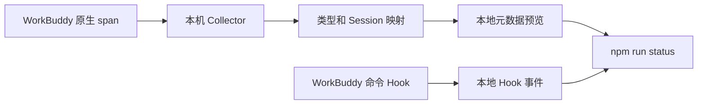

# WorkBuddy Langfuse Plugin

当前版本 **0.1.0 / 第一阶段：本地诊断**。这版用于确认 WorkBuddy 主任务能否产生完整、可关联的原生追踪，为后续 Langfuse 上报准备可靠数据。

已实现：命令型 Hook 诊断插件、标准 OTLP Collector、Langfuse 类型与 Session 字段转换、模拟链路测试、真实数据统计。**本阶段没有 Langfuse exporter，不需要填写密钥，不会回灌历史会话。**

| 阶段 | 交付 | 状态 |
|---|---|---|
| 1 | 原生链路接收、字段映射、Hook 诊断、可重复运行的验证 | 当前版本；桌面主任务待你验证 |
| 2 | Langfuse 上报、内容选择与用量校验、两轮会话验收 | 阶段 1 验证后实现 |
| 3 | 运行中状态、按步骤增量采集、去重与恢复 | 阶段 2 验证后实现 |

## 开始验证

需要 macOS、WorkBuddy、Node.js 22+ 和已启动的 Docker Desktop。无需安装 npm 依赖。

```bash
cd /Users/boqingyun/workspace/ai/workbuddy-langfuse-plugin
npm run doctor
npm run collector:start
npm run demo
```

首次启动需要下载固定版本的 Collector。等 2 秒后运行：

```bash
npm run status
```

预期 `synthetic` 中出现 1 个 trace、4 个 spans，其中 `agent=1`、`generation=1`、`tool=1`、`span=1`。再次执行 demo 会创建新模拟 trace，因此数量会增加。**synthetic 成功只证明接收和转换通道可用，不代表 WorkBuddy 已接入。**

然后完全退出 WorkBuddy，通过下面的入口重新打开：

```bash
npm run workbuddy:launch
```

这个入口仅为本次 WorkBuddy 进程设置本地 OTLP 地址和插件开发目录，不修改 `settings.json`。已有 WorkBuddy 未退出时，命令会停止，不会关闭你的任务。

新建一个测试任务，发送：

```text
请执行 pwd，然后回复 WB_LF_PHASE1_001。
```

完成后，在同一个任务继续发送：

```text
请执行一个等待 3 秒的命令，然后回复 WB_LF_PHASE1_002。
```

等 5 秒，再执行 `npm run status`。按[第一阶段验收表](docs/phase-1.md)检查真实 `native` 数据和 `hooks` 计数。**如果只有 synthetic 或辅助 span，第一阶段仍未通过。**

## 本阶段的数据范围

- Collector 只保存结构元数据：来源、Session、span 类型、模型名、调用 ID、原始起止时间、可用的 Token 数量。已知的消息、工具内容、错误正文和资源身份字段不会写入诊断文件。
- Hook 只保存事件名、Session、工具名和调用 ID；不读取 transcript，也不保存提示词、工具参数或返回正文。Hook 失败静默退出，不向 Agent 注入内容。
- 启动入口使用 WorkBuddy 默认的 `codebuddy` 语义，关闭正文开关。没有开启会自动带出模型输入输出的 `agentlens` 模式。原生没有 usage 时按未知展示，阶段 2 再核验其采集路径。
- 这是诊断记录，**没有实现去重上报**。重复的 trace/span ID 会显示在 `duplicateIdentities`，不会被统计工具隐藏。状态工具当前全量读取诊断文件，不是增量上传器。
- WorkBuddy 自带的其他遥测渠道维持其原有行为；本地端点只限定本项目的采集通道，不表示 WorkBuddy 所有网络行为都变成本地。



## 文件和端口

| 项目 | 默认位置 |
|---|---|
| OTLP 接收地址 | `http://127.0.0.1:14318/v1/traces` |
| 诊断链路 | `.local/collector/traces.jsonl`，不提交 Git |
| Hook 诊断 | `~/.workbuddy/langfuse-plugin/hooks.jsonl` |
| WorkBuddy 启动日志 | `.local/workbuddy-startup.log`，不提交 Git；可能包含服务运行信息，请勿直接分享 |
| 插件 | `plugins/workbuddy-langfuse/` |
| 分阶段设计 | [docs/design.md](docs/design.md) |

如端口冲突，可在当前终端 `export WB_LF_PORT=14328`，然后停止并重启 Collector、使用同一终端重新启动 WorkBuddy。可用 `WORKBUDDY_APP_PATH` 指定应用安装目录，`WORKBUDDY_LANGFUSE_DATA_DIR` 指定 Hook 数据目录。

退出 WorkBuddy 后从日常入口重新打开，即可退出本次诊断启动环境。停止接收端：

```bash
npm run collector:stop
```

上述停止命令保留诊断文件，也不会操作已有的 Langfuse 服务。

## 开发验证

```bash
npm test
npm run test:collector
npm run test:plugin
```

- `test`：检查 Hook 不阻塞、内容不落盘、并发写入及诊断统计。
- `test:collector`：独立容器把模拟 JSON 转为 protobuf，再通过正式接收和转换配置；检查 ID、层级、时间、用量和内容过滤。测试结束自动清理容器。
- `test:plugin`：以临时配置启动 WorkBuddy 内置引擎，验证开发目录插件被发现、启用、manifest 有效，且运行时恰好加载 6 个 Hook；没有模型请求，不修改你的 WorkBuddy 配置。

测试中的“内置引擎加载成功”与“桌面主任务 Hook 已自动触发”是两个独立检查。

本机 5.5.3 内置 CLI 的 `plugin validate/install/marketplace add` 命令在本次检查中出现位置参数错位，且失败时退出码可能为 0。因此本阶段使用引擎支持的 `CODEBUDDY_PLUGIN_DIRS` 开发目录加载，未提供可能误报成功的安装脚本。正式市场安装流程将在后续阶段验证。

Hook 文件使用 manifest 显式指定的 `hooks/events.json`。5.5.3 对默认 `hooks/hooks.json` 存在重复加载行为；改名后真实引擎测试确认每个事件只注册一次。详见[验证记录](docs/verification.md)。
