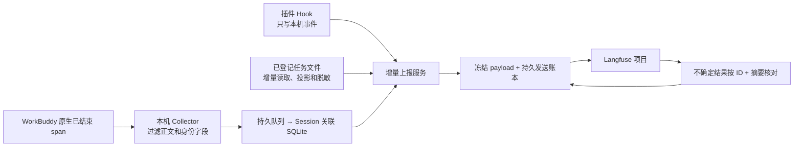

# WorkBuddy Langfuse Plugin

**v0.4.0 · 阶段 1–3 已实现并通过验收。** [查看验收证据](docs/acceptance-phase3-2026-09-08.md)

把 WorkBuddy 桌面任务中的模型调用、工具执行和 Token 用量自动送到你的 Langfuse 项目，用同一个 Session 查看多轮任务、原生父子关系和每一步的真实耗时。

这是一个独立集成项目，包含 **WorkBuddy 插件、本地 Collector 和上报服务**。插件负责通知本地服务任务发生了什么；原生 OpenTelemetry 提供正式追踪记录；任务文件只补充模型、缓存、积分和可选正文。无需安装 npm 依赖。当前适配与实测环境为 **macOS、WorkBuddy 5.5.3、Node.js 24、Docker Desktop、Langfuse OTLP v4**。

## 开始使用

准备一个 Langfuse 项目，在项目设置的 API Keys 页面生成项目密钥。已有自托管 Langfuse 或 Langfuse Cloud 均可配置；本仓库不部署或修改你的 Langfuse 服务。

```bash
git clone https://github.com/fine405/workbuddy-langfuse-plugin.git
cd workbuddy-langfuse-plugin
npm run configure
```

跟随提示填写 Langfuse 地址、Public Key 和 Secret Key。密钥不回显、不提交 Git。默认 `metadata` 只发送结构和用量；选择 `text` 才发送经过脱敏、截断的用户问题、模型回复和工具输入输出。

完全退出 WorkBuddy，启动 Docker Desktop，然后：

```bash
npm start
```

这个入口会检查环境、安装或更新插件、启动本地服务，并带采集配置打开 WorkBuddy。以后需要采集时也通过 `npm start` 打开。**直接点击普通 WorkBuddy 图标启动，不会自动启用本项目的采集。**

在 WorkBuddy 新建一个无敏感内容的任务，例如：

```text
请依次分两次调用终端：先执行 printf WB_LF_FIRST，
拿到结果后执行 sleep 30 && printf WB_LF_SECOND。
不要读取文件或访问网络，最后回复 WB_LF_DONE。
```

```bash
npm run service:status
```

从 `sessions[].sessionId` 找到刚才的任务，在 Langfuse 的 Sessions 页面打开同一 ID。已完成的步骤会先出现，整轮结束后根 observation 才到达；Langfuse 入库本身也有延迟。本机一次真实验收中，第一工具结束约 10 秒后已可查询，第二个 30 秒工具当时仍在执行，这不是固定延迟承诺。

更多操作见[接入指南](docs/getting-started.md)。首次使用仍建议先跑无敏感任务，不用真实业务正文测试。

## 可以看到什么

| 信息 | 来源与含义 |
|---|---|
| Session、Trace、父子关系、起止时间 | WorkBuddy 原生 ID 和已结束 span；不另造一套重复的模型追踪 |
| 实际模型、输入/输出/缓存 Token | 用 Session + Trace + message ID 对照任务文件；一次响应调用多个工具也只计一次用量 |
| WorkBuddy 积分 | 原始 `rawUsage.credit`，保存为 `metadata.workbuddyCredits` |
| 美元估算 | 可按有来源的模型价格显式配置；积分不等于美元，未知费用不填零冒充真实账单 |
| 模型与工具正文 | 显式开启后采集；不含 system、reasoning、文件快照或完整模型历史上下文 |
| 正在执行、等待审批、无新活动、进程退出 | `service:status` 的本地证据；不伪造未完成 span 的耗时与结果 |

[字段与隐私范围](docs/data-model.md)解释缓存拆分、正文范围、费用和脱敏限制。

## 怎样上报、怎样避免重复



不会在每次 Hook 后把整份对话全量上传。任务文件按字节游标增量读取，正式发送以 `项目 + traceId + spanId` 为身份，已确认的记录跳过，内容变化会报错隔离。Langfuse 展示去重不是本项目的可靠性基础。

请求可能已经入库但响应丢失时，服务先查询远端；找到相同 ID 与摘要才确认成功，查不到则保留待确认。不能承诺端到端 exactly-once。完整时序、故障边界见[架构与恢复原理](docs/architecture.md)。

## 日常操作

| 操作 | 命令 |
|---|---|
| 配置与校验密钥 | `npm run configure` |
| 安装/更新并启动完整接入 | 退出 WorkBuddy 后 `npm start` |
| 看自动发送和运行状态 | `npm run service:status` |
| 看底层采集诊断 | `npm run status` |
| 停止接收和上报，保留历史 | `npm stop` |
| 核验一个完成的 Session | `npm run langfuse:verify -- <Session ID>` |
| 核对不确定发送 | `npm run recover` |
| 仅卸载 Hook 插件 | 退出 WorkBuddy 后 `npm run plugin:uninstall` |

更新、卸载、故障恢复和常见问题见[接入指南](docs/getting-started.md)与[排障手册](docs/troubleshooting.md)。

## 学习和验证

先看[架构](docs/architecture.md)，再看[字段映射](docs/data-model.md)，最后读 `scripts/sidecar.mjs` 中的采集和发送流程。阶段设计及历史验收保留在 [docs/design.md](docs/design.md) 和验收记录中；历史版本文档不代表当前安装方式。

```bash
npm test
npm run test:collector
npm run test:plugin
npm run test:langfuse
```

前三项分别检查逻辑、真实 Collector 协议链路、真实 WorkBuddy 插件引擎。`test:langfuse` 会向当前项目写入带 synthetic 标记的测试记录，并从真实 Langfuse 查询核对；它不运行模型，也不替代桌面验收。

验收证据：[阶段 1 修复](docs/acceptance-2026-09-08.md)、[阶段 2A](docs/acceptance-phase2a-2026-09-08.md)、[阶段 2B](docs/acceptance-phase2b-2026-09-08.md)、[阶段 3 与完整验收](docs/acceptance-phase3-2026-09-08.md)、[完整交付清单](docs/completion-plan.md)。
