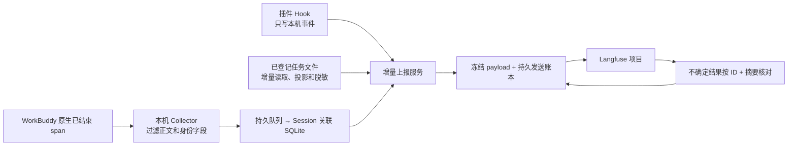
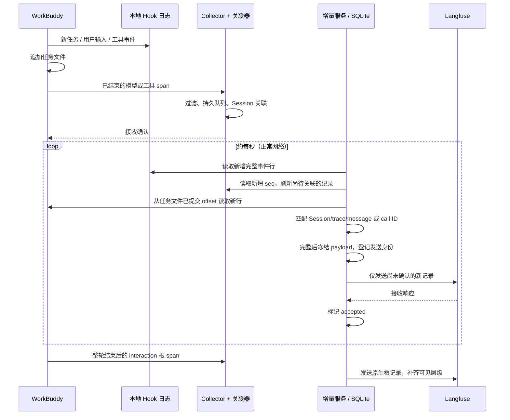
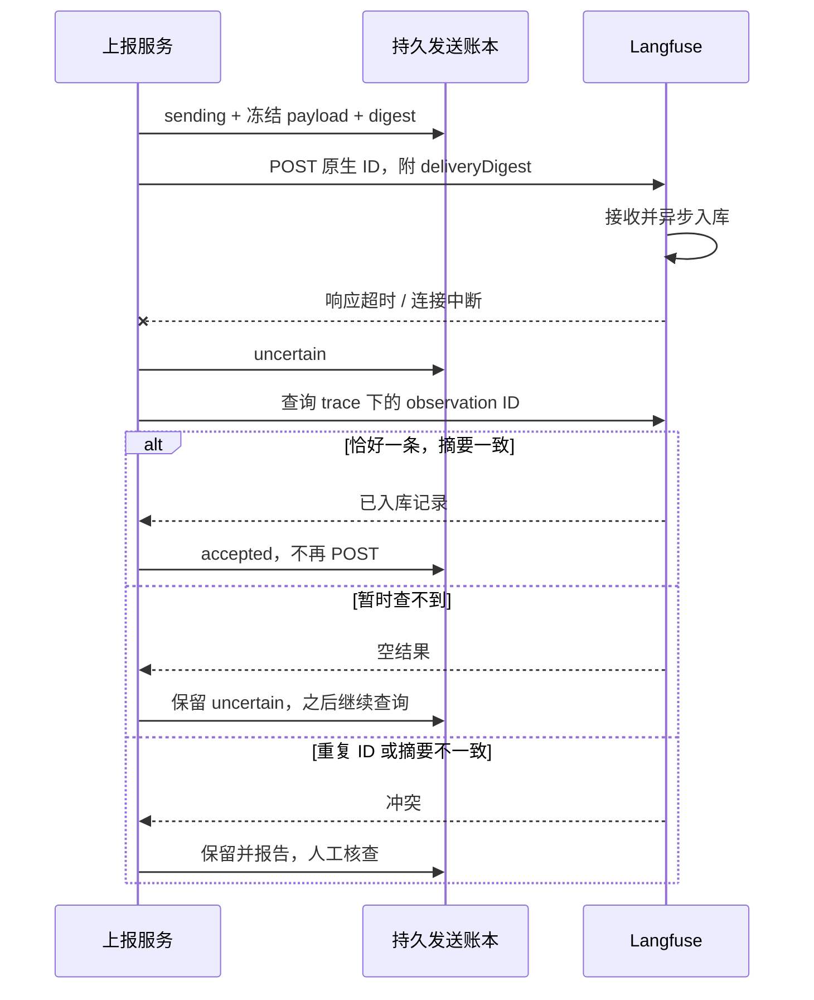

# 架构、增量读取与恢复

集成由 WorkBuddy 插件、本地 Collector 和上报服务组成。插件通知任务事件，原生 OpenTelemetry 提供正式追踪记录，任务文件补充模型、缓存、积分和可选正文。

本项目不会在每次 Hook 后全量重传整份对话。任务文件增量读取，已确认发送的记录由本地账本跳过；不能把 Langfuse 展示去重当作可靠性基础，也不能承诺端到端 exactly-once。下面按正常上报、发送身份和故障恢复解释具体时序。字段映射与正文范围见[数据模型](data-model.md)。

## 安装、配置与启动

安装器将程序复制到固定的用户目录，创建命令行和可双击的操作入口。程序、配置和运行数据分别保存：

| 内容 | 默认位置与职责 |
|---|---|
| 程序 | `~/.workbuddy/langfuse-plugin/app/`，包含 Hook 插件、Collector 配置及上报服务 |
| 用户配置 | `~/.workbuddy/langfuse.json`，保存连接、密钥、采集开关、正文模式和运行设置 |
| 运行数据 | `~/.workbuddy/langfuse-plugin/state/`，保存关联结果、读取游标、待发送记录和发送账本 |
| 操作入口 | `~/Applications/WorkBuddy Langfuse/` 和 `~/.local/bin/workbuddy-langfuse` |

配置向导提供组织与项目的创建指引，使用项目密钥查询实际项目。密钥由本地上报服务持有，启动 WorkBuddy 时不传入密钥。向导以原子替换方式保存权限为 0600 的配置文件，认证失败或项目与现有账本冲突时不覆盖原配置。

启动入口先检查 WorkBuddy 已退出、配置已启用、发送目标与端口可用，再安装 Hook 插件、启动 Collector 和上报服务，最后带原生遥测设置打开 WorkBuddy。配置在进程启动时读取，正文模式按 Session 固定；更改后需要重新启动接入并新建任务。具体操作见[接入指南](../users/getting-started.md)。

更新替换程序文件，保留用户配置与运行数据。卸载移除插件、程序和操作入口，保留配置、队列与发送账本。保留发送身份是后续重启或重新安装时避免重复发送的基础。

## 三条本地输入汇合

正式 observation 来自 WorkBuddy 原生 OpenTelemetry。Collector 删除正文、原生资源身份及错误正文，映射 observation 类型，然后通过持久磁盘队列交给 Session 关联器。关联器在事务提交后才确认接收；按 trace ID 补齐缺失 Session，冲突保留并隔离。

Hook 只写短事件，不读任务文件、不请求 Langfuse，不把错误注入 Agent。它登记 Session 对应的任务路径、正文模式，以及可识别时的 worker PID 与进程启动身份。运行状态发生在本地，不另外生成收费的模型 observation。

服务校验真实路径位于 WorkBuddy projects 目录且文件名匹配 Session，按字节游标读取新增完整行。只投影需要的记录，丢弃 reasoning、系统提示和文件快照，再持久化。不是每次 Hook 都从头解析整份任务文件，也不是每次都重新上传所有历史 span。

原生 SDK 只提供结束后的 span。模型请求或工具仍在运行时，Langfuse 可能暂时没有它；先到的子 observation 也可能暂时指向尚未到达的父 ID。服务保留该父 ID，不伪造一个已结束根节点。WorkBuddy interaction 的外层父 ID 若未在该 trace 中导出，会显式作为边界清除，并保留 `nativeParentSpanId` 元数据。

## 完整性与发送身份

| 层次 | 身份或游标 | 保证 |
|---|---|---|
| 原生接收 | 每次到达独立 seq | 诊断保留重复，方便发现上游重传 |
| Session 关联 | trace ID | 跨批次、重启后补齐子 span；冲突不借用别的 Session |
| Hook 文件 | 文件身份 + byte offset + 事件摘要 | 半行不推进，重复日志不重复增加子代理计数 |
| 任务文件 | 文件身份 + byte offset；Session + 类型 + record ID + call ID | 半行等待；截断/替换从头重新投影，记录 upsert 避免重复计数 |
| 模型用量 | Session + trace ID + message ID | 一次响应调用多个工具，只算一份用量 |
| 正式发送 | Langfuse 项目 + trace ID + span ID + payload SHA-256 | 已确认跳过；相同 ID 内容变化报错 |

模型使用量必须能与原生输入/输出相互核对，缓存约定必须可确认。工具调用型模型响应会等对应工具结果都写入，再冻结输出列表；因此某些 generation 的发送会晚于模型实际结束。已结束的工具和普通步骤仍可先发送。

任务文件发生原地截断、替换或恢复时，游标重新读取能修复读取位置；它不授权覆盖已发送的历史。编辑/重生成若复用原生 ID 且改变正文，会触发摘要冲突。需要新的原生身份或人工审查，不直接 overwrite。

## 响应丢失时

`accepted` 代表完整 HTTP 接收确认或查询核对成功，不能据此判断每个字段都已核对。`langfuse:verify` 会另查真实入库数据。发送前的连接拒绝、DNS 失败可证明尚未发送 HTTP 正文，因此可以延迟重试；其他网络异常保守进入 uncertain。重启遗留的 sending 也按不确定结果处理。

每个请求最多 50 条、正文控制在约 3 MiB；队列与账本持久化。不确定记录不阻塞其他 Session 的可发送记录。查询缺失不能证明永远未入库，人工确认缺失的释放入口见[排障](../users/troubleshooting.md)。

## 能恢复的范围

已经进入 Collector 持久队列、关联 SQLite 或本地发送队列的数据，可以在对应进程恢复后继续处理。服务重启保留读取游标和发送账本，不回放已确认的网络请求。

原生 SDK 交给 Collector 之前仍有窗口：WorkBuddy 崩溃、内存中的未结束 span、Collector 长时间不可达等可能导致尚未持久化的数据缺失。任务文件不是原生 span 的完整替代，服务不会凭猜测重造丢失的时间线。Hook 丢失也可能使新任务未被登记。底层丢失应作为采集缺口报告，不能被去重逻辑“修复”。

服务没有云端后台依赖，也不自启动登录项。电脑关机、休眠或手动停止后不会持续运行。恢复工作时通过专用启动入口重新打开 WorkBuddy。

## 代码对应关系

| 入口 | 职责 |
|---|---|
| [install.mjs](../../scripts/install.mjs) | 安装程序、创建操作入口及更新和卸载 |
| [settings.mjs](../../scripts/settings.mjs) · [wizard.mjs](../../scripts/wizard.mjs) | 统一配置读取、校验与交互问题 |
| [setup.mjs](../../scripts/setup.mjs) | 项目认证、启动、配置和状态展示 |
| [WorkBuddy 插件](../../plugins/workbuddy-langfuse) | Hook 事件声明与本地通知 |
| [Collector](../../collector) | 原生 OTLP 接收、过滤、持久队列及 Session 关联 |
| [sidecar.mjs](../../scripts/sidecar.mjs) | 增量读取、任务状态与自动发送 |
| [enrichment.mjs](../../scripts/enrichment.mjs) | 模型、用量和可选正文的补充 |
| [langfuse.mjs](../../scripts/langfuse.mjs) · [recovery.mjs](../../scripts/recovery.mjs) | 持久发送账本、远端核对与恢复 |

继续阅读[字段、费用与正文边界](data-model.md)，或[返回文档导航](../README.md)。
