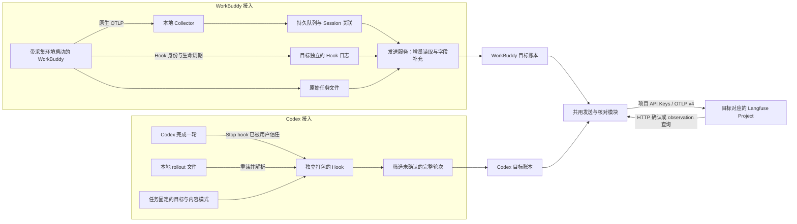

# 整体架构

helper 负责发现 agent、提供交互入口、管理上报目标以及调用对应扩展。WorkBuddy 和 Codex 各自处理原始事件，共用发送账本与远端核对逻辑。两种采集器不依赖彼此运行。

## 数据流

图中的共用模块是两种运行进程引用的代码，不是一个新增的常驻网关。WorkBuddy 需要 Docker Collector 与后台服务；Codex hook 是短进程，不经过 WorkBuddy Collector，也不需要 Docker。

## 配置与状态

配置默认放在 `~/.langfuse-helper/`：

| 内容 | 作用 |
|---|---|
| `config.json` 的 targets | URL、项目密钥、实际 Project ID |
| `config.json` 的 agents | 选择 target，保存采集开关与正文模式 |
| `state/<agent>/<target-hash>/` | 各 agent、各目标独立的队列与发送记录 |
| `bindings/codex/` | 固定 Codex 任务的目标、首轮采集边界与正文模式 |

`target-hash` 由规范化 URL 与实际 Project ID 生成。密钥轮换不创建空账本；相同 Project 下两个 agent 的发送记录也不会互相跳过。

WorkBuddy 读取目标目录的运行快照，切换绑定前停止原服务；旧队列留在旧目标。Codex hook 每次读取采集开关，但已绑定任务不能自动换投其他 Project。

## Codex 上游代码如何纳入

保留并随包发布 Langfuse 插件的 rollout 解析源码：`parse.ts`、`types.ts`、`utils.ts`。helper 维护自己的 hook、OTLP 映射与发送流程，并用构建工具合成单个运行文件。Codex 安装到缓存后无需引用 helper 源码路径或安装 SDK。

上游原实现的 SDK 初始化、配置合并、读取 Codex 登录邮箱以及 `.langfuse` sidecar 写入逻辑不随此版本启用。这里直接使用 helper 的配置、内容边界和可靠发送模块，避免并存两套配置和发送标记。源版本及许可见 [上游来源与许可](../../plugins/codex-langfuse/UPSTREAM.md)。

[上报时序](sequences.md) · [字段与费用](data-model.md)
