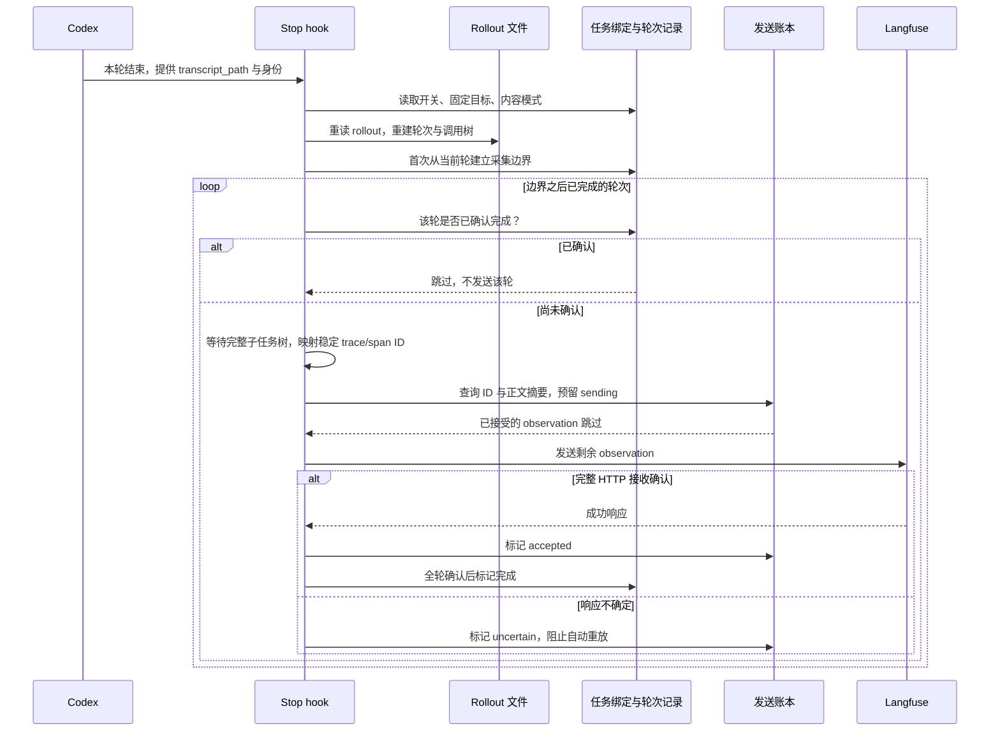
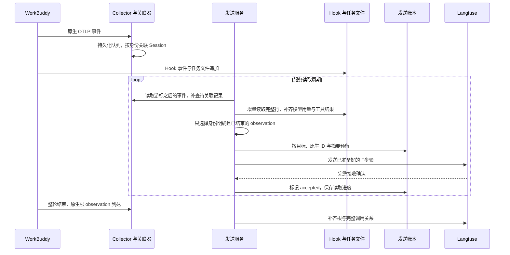
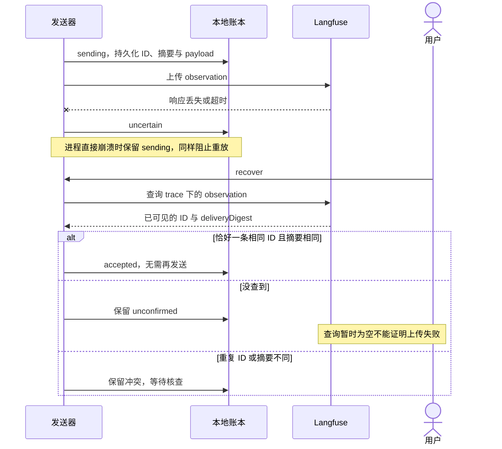

# 配置、上报与恢复时序

## Codex：重读全文件，不等于重发全文件

这里有两个层次：轮次记录避免反复构造和上传已完成轮；账本以 `target + traceId:spanId + digest` 处理跨进程重试、部分完成与响应丢失。实际 Project 身份同时参与目录隔离与账本查询。

- 首次 Stop 默认从当前轮开始，缺少 turn ID 时从最后一个已完成轮开始，不自动补发更早历史。
- 未完成轮不发送。子任务文件缺失或子任务仍未完成时保留待处理状态，等后续 Stop，或完成后显式 `codex export <rollout-path> --send`。
- 子任务挂在父轮下，不单独由自己的 Stop 重复生成主 Trace。当前实现以父轮导出时已完整的树为快照；已确认父轮不会追补之后新产生的子任务轮次。
- HTTP 接收确认不是“页面已可见”，Langfuse 异步入库可能延迟。
- 同一 ID 内容变化会停止发送，不把它当成可以覆盖旧记录的更新。

上游固定版本的 `.langfuse` sidecar 按已完成 turn ID 跳过轮次，但在 SDK 最终网络刷新前记录，且不按目标分离。本实现不使用它。上游来源见 [UPSTREAM.md](../../plugins/codex-langfuse/UPSTREAM.md)。

## WorkBuddy：持续增量读取

已完成子步骤可能先出现，整轮结束后根节点补齐。重复到达保留在诊断层，不等于重复上报。未收到的原生数据不会靠猜测重建；Collector 不可达且原生 SDK 未持久化的部分仍可能形成采集缺口。

## 两种 agent 共用的响应丢失恢复

WorkBuddy 后台服务也会执行远端核对；Codex 没有常驻恢复进程，使用 `recover` 后在下一次 Stop 或显式 export 继续。明确未建连、确定的认证拒绝可以重试；响应不确定不能仅凭超时就标记失败重发。这是保守的可靠发送策略，不是对任意故障承诺 exactly-once。

[架构](overview.md) · [使用者排障](../users/troubleshooting.md)
