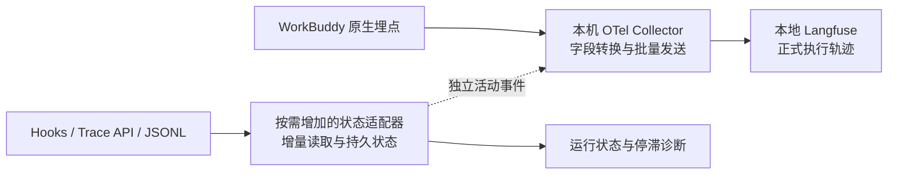

**WorkBuddy 接入本地 Langfuse 方案**

> 本文保留前期调研方案。实施时将原 P0 拆为“阶段 1：本地诊断”，原生 Langfuse 写入放在阶段 2，运行诊断与恢复放在阶段 3。当前可执行步骤以项目 README 和 phase-1.md 为准；阶段 1 使用端口 14318、`OTEL_SEMCONV=codebuddy`，没有 Langfuse 出口。

调研日期：2026-09-07。范围：本机 WorkBuddy 5.5.3、已有的 Langfuse v4 部署。本次只做设计与只读检查，没有启用追踪、修改应用配置或上传会话。

**建议：以原生 OTLP 为主，加一层字段转换；Hooks 与 JSONL 用于运行状态和缺失数据补充。Codex 插件适合作为轨迹转换的参考，不宜原样移植。**

沿用「接入 Langfuse 到 Codex」中的目标：数据进入本地 Langfuse；能复盘模型、工具与子代理；长任务中途也能发现活动停滞；重复触发不能反复累计 Token 和费用。这里的“实时”区分为已完成步骤的增量入库，以及尚未结束步骤的运行状态。

**1. 已核实的接入基础**

| 项目 | 证据与判断 |
|---|---|
| WorkBuddy 版本 | 本机安装包 `package.json` 为 5.5.3。内置 CLI 包版本写作 0.0.0，不能据此宣称它等同于某个公开 CLI 版本。 |
| 原生链路 | 安装包存在 interaction、model_stream、tool、mcp_call、subagent 等 span 埋点与 OTLP HTTP/protobuf exporter。存在埋点不等于主任务链路已完整导出，仍需运行验证。 |
| 通用语义 | 本机文档及实现都包含 `OTEL_SEMCONV=agentlens`，可以补充模型、用量与输入输出字段，并在该导出路径过滤辅助 `model_request` span。 |
| 会话轨迹 | 实际 JSONL 含 message、reasoning、function_call、function_call_result。抽样文件现有 91 次调用和 91 条返回，并含 `sessionId`、`callId`、`providerData.traceId`、`conversationRequestId`、`messageId`。 |
| 运行状态 | 前序任务已验证本地 Trace API 可认证访问；安装包实现支持查询 running 状态和 worker 转发。本次没有验证所有主任务模式均进入该 API。 |
| Langfuse | 正在运行的 Web、Worker 镜像标签均为 `:4`。新方案遵循 v4 的不可变入库语义。 |

官方 [CodeBuddy 监控文档](https://www.codebuddy.cn/docs/cli/monitoring)说明了 OTLP 与内容开关；[WorkBuddy 插件文档](https://www.workbuddy.cn/docs/workbuddy/From-Beginner-to-Expert-Guide/Function-Description/Plug-In)明确包含 Hooks。公开 CLI 文档用于参考，本机安装包与实际触发结果决定最终兼容范围。

**2. 推荐架构与最小实现**



第一阶段仅实现实线中的原生链路：WorkBuddy → 标准 OpenTelemetry Collector → Langfuse。Collector 负责接收 protobuf、映射属性、保留调用层级和统一添加 Langfuse 认证。优先采用标准组件的 transform processor，不自行开发 OTLP 协议服务。

第二阶段按实际缺口增加小型状态适配器。它读取正在运行的状态，以及尚未完整进入原生 tracing 的会话信息。所有 Hook 都只通知同一个适配器或写入它的本地队列，不在 Hook 中全量解析、联网重试。

| 路径 | 适用范围 | 取舍 |
|---|---|---|
| WorkBuddy 直接 OTLP → Langfuse | 连通性试验 | 组件最少，但类型与 Session 不一定识别正确。 |
| 原生 OTLP → Collector → Langfuse | 推荐的第一版 | 保留真实起止时间，完成步骤可以持续导出；增加少量字段转换。 |
| Hooks / JSONL → 适配器 → Langfuse | 原生主链路缺失时的备用模式、历史复盘 | 需要维护 WorkBuddy 专用解析器；不能保证还原每次模型请求的准确起止时间。 |

不以 MCP 作为自动采集入口：工具连接可以帮助查询 Langfuse，但不能据此自动覆盖 WorkBuddy 内部的全部模型和工具执行。

**3. 数据模型与字段映射**

目标是一个 WorkBuddy 会话对应一个 Langfuse Session；一次用户请求对应一个 Trace；其中的模型请求、工具和子代理对应 observations。优先保留原生 `traceId / spanId / parentSpanId`，不重新创建另一棵推测的调用树。

```text
Session：WorkBuddy 会话
  Trace：第 1 次用户请求
    WorkBuddy Turn（agent）
      LLM（generation）
      Read / Bash / MCP（tool，保留原生父子关系）
      Subagent（agent）
        LLM / Tool
      LLM（generation）
  Trace：第 2 次用户请求
```

| WorkBuddy 输入 | 适配后的 Langfuse 属性或行为 |
|---|---|
| `span.type=interaction / subagent` | `langfuse.observation.type=agent` |
| `span.type=model_stream` | `langfuse.observation.type=generation` |
| `span.type=tool / mcp_call` | `langfuse.observation.type=tool`；嵌套 MCP 与外层工具保留各自含义，统计业务调用次数时避免双计。 |
| context_compact / user_input_wait 等 | 普通 span；保留压缩、等待审批等原始类型，不计作模型调用。 |
| `gen_ai.session.id`，或已核实的 `workbuddy.session_id / workbuddy.session.id / conversation.id` | `langfuse.session.id`；对每个 span 写入。 |
| `gen_ai.request.model` 等已确认的模型字段 | `langfuse.observation.model.name` |
| `input.value / output.value` | `langfuse.observation.input / output`；保留结构化内容和截断标记。 |
| 工具 span events 中的输入输出 | 必要时提取到 observation 输入输出，不只藏在事件列表中。 |
| 原生状态、起止时间、错误 | 原样保留；用户取消与实际执行错误分开标记。 |
| `conversationRequestId / messageId / tool.call_id` | 保存为来源关联元数据，用于排查与去重。 |

这层转换有明确必要性：本机 WorkBuddy 输出 `gen_ai.span.kind=AGENT/LLM/TOOL`，并使用大写 `gen_ai.operation.name=CHAT/INVOKE_AGENT`；检查的 Langfuse 源码则按 `openinference.span.kind`、小写通用 operation 或显式 `langfuse.observation.type` 映射。Session 解析列表也没有 `gen_ai.session.id`。模型可能通过其他字段被识别，但不能因此认为 Agent、工具和 Session 都正确。

上述是本机代码对照结论，尚未以线上数据验收；运行的容器与源码 checkout 也不能仅凭同为 v4 就视为完全一致。实现时显式设置 Langfuse 属性，以降低这种差异的影响。参见 [Langfuse 类型映射源码](https://github.com/langfuse/langfuse/blob/7637df1e1aadddbbfd0a45b960ecc97451381ce5/packages/shared/src/server/otel/ObservationTypeMapper.ts)、[接收处理源码](https://github.com/langfuse/langfuse/blob/7637df1e1aadddbbfd0a45b960ecc97451381ce5/packages/shared/src/server/otel/OtelIngestionProcessor.ts)。

用量只取最终模型调用的实际 usage。根 span、工具、运行活动事件不再携带一份可计费用量。`model_request` 与 `model_stream` 不同时计作 generation。缺失 usage 留空，累计 usage 不逐条求和；缓存与普通输入是否重叠要按上游语义核验。WorkBuddy 积分 `credit` 不转换成美元，Langfuse 推算费用与实际账单分开理解。

**4. 解决“中途卡住看不到”**

原生 OTel 通常在 span 结束后导出：一个工具结束就可以上传，不必等整轮 Stop；但永不返回的工具 span 仍不会成为完整导出记录。Collector 本身无法推导这个尚未收到的开始时间。

因此增加运行状态采集时，优先读取 Trace API 的活动 span；Hooks 补充 UserPromptSubmit、PreToolUse、PostToolUse、失败与结束事件；JSONL 提供落盘活动证据。不能假设新版公开文档列出的每个 Hook 都已在 WorkBuddy 5.5.3、所有模式中触发，先以本机可用事件验收。

状态适配器保存：会话、轮次、活动步骤、开始时间、最后活动时间、是否等待用户、所属 worker，以及已知的原生 trace ID。初始可每 2 秒检查一次活动任务；停滞阈值按步骤类型配置，先用 60 秒作为测试阈值，而非宣称 60 秒就是故障。

必须区分：运行中、等待用户、暂未观察到新活动、用户取消、确定失败。单凭日志未追加，不把慢模型判为失败。Trace API 若无法覆盖模型运行，而 Hooks 又没有模型请求事件，应明确保留“模型卡顿不可精确定位”的边界。

Langfuse 中的完整根 observation 到本轮结束时才发送。子 observation 提前入库后，Trace 列表、树视图是否在根到达前可用，需要实测，不能承诺“接上 OTLP 就有完整实时界面”。

若必须直接在 Langfuse 看运行告警，可把开始或停滞检测做成独立、一次性的 `WorkBuddy Activity` 记录，按 Session 和 `sourceTraceId` 关联正式轨迹；使用独立 ID，不带 Token/费用，也不反复写同一个“进行中” observation。性能统计过滤此类活动记录，防止额外 Trace 影响任务数与耗时统计。

**5. 增量读取与重复上报控制**

Langfuse v4 的已入库 observations 不支持通过相同 ID 可靠覆盖。重新发送会造成重复记录与重复累计费用，稳定 ID 只能帮助关联，不能代替去重。参见 [Langfuse 更新规则](https://langfuse.com/faq/all/tracing-data-updates)。

采用以下规则：

1. **一个正式数据来源。** 默认由原生 tracing 负责 generation/tool。JSONL 只补活动或未发送的附加信息，不把整轮再上传一遍。如果原生链路不满足要求，在新测试会话中明确切换为 transcript 模式，停掉该会话的原生正式导出；不在同一轮中途自动切换。
2. **原生转发保留 ID。** 只配置一条到 Langfuse 的正式导出路径，避免 direct exporter 与 Collector 同时上报。
3. **JSONL 读取保存游标。** 记录文件标识、读取偏移与未完整的一行；只解析新追加的完整行。遇到文件缩短或替换时重新识别，同时依靠记录 ID 去重。Hook、文件变化与定时扫描共用同一状态。
4. **按 observation 去重。** 工具键使用 `(sessionId, turnKey, callId)`；模型键优先使用已确认的请求/消息 ID。`turnKey` 优先依据原生 trace ID 与 conversationRequestId 的实测关系。不能把每条 message 或 reasoning 都当成一次模型调用；同一次模型响应携带的多个工具也不能重复计 usage。
5. **导出完成记录。** 有明确结果或结束证据后才生成正式 observation。Stop 只是触发核对，不保证最终记录已落盘；读到半行继续等待。时间推断标记为 estimated，不伪装成真实埋点耗时。
6. **先持久化再推进。** 适配器用 SQLite 事务保存游标、唯一键和待发送记录；联网在 Hook 外执行，成功确认后再标记已发送。采集失败不阻塞 WorkBuddy，也不返回要求 Agent 继续工作的控制结果。

标准 OTel Collector 的队列与重试并不提供端到端“恰好一次”。连接超时可能意味着远端已收到；这一点即使加 SQLite 也不会自动消失。首版接受并记录这一有限风险；若要求费用严格不重复，再增加逐条发送账本与不确定状态核对。对“已发出但确认丢失”的记录，先按 ID 查验，查询尚未找到也不能立即当作未入库；不无限盲目重放。此强化功能有明确成本，不作为第一阶段前置条件。

历史 JSONL 导入使用单独标记或独立项目；已采集过的会话不自动回灌。用户中断或进程崩溃后，可记录恢复诊断，不能把本地仍活动的记录先猜成最终失败、之后再试图覆盖。

**6. 配置与部署契约**

推荐新增 Langfuse 项目 `WorkBuddy Local`，复用现有本地部署。密钥属于这个项目，放在 Collector 的本地私密配置中，WorkBuddy 仅访问本机接收地址。下列是拟采用的配置，不代表已应用：

```dotenv
# 注入实际启动 WorkBuddy 内置引擎的进程
CODEBUDDY_CODE_ENABLE_TELEMETRY=1
OTEL_TRACES_EXPORTER=otlp
OTEL_EXPORTER_OTLP_TRACES_ENDPOINT=http://127.0.0.1:4318/v1/traces
OTEL_EXPORTER_OTLP_TRACES_PROTOCOL=http/protobuf
OTEL_SERVICE_NAME=workbuddy
OTEL_SEMCONV=agentlens
```

Collector 出口：`http://127.0.0.1:3000/api/public/otel/v1/traces`；HTTP 请求头为 `Authorization: Basic <base64(public_key:secret_key)>` 与 `x-langfuse-ingestion-version: 4`。Collector 若运行在容器中，应改用可达的容器服务名或宿主机地址，不能把容器内的 localhost 当作宿主机。端点与 v4 实时入口见 [Langfuse OTLP 文档](https://langfuse.com/integrations/native/opentelemetry)。

内容完整性测试时再开启 `OTEL_LOG_USER_PROMPTS`、`OTEL_LOG_TOOL_DETAILS`、`OTEL_LOG_TOOL_CONTENT`。本机文档提示 `agentlens` 会连带产生模型输入输出，不能把它理解为只改字段名。转换层应统一处理敏感字段和长度，保留截断标记；不默认上传原始 reasoning 内容或文件快照。

WorkBuddy 由 Finder 启动时不保证继承终端配置。接入实验需完全退出后通过明确的启动环境拉起，并检查内置服务与 worker 的实际继承情况；不要只写终端配置就宣布生效。多 worker 需要分别确认导出路径。

前序检查表明 WorkBuddy 存在 Galileo 等附加遥测通道。自定义 OTLP 地址不能证明所有遥测都改为本地。内容开关是否也作用于其他导出通道，需要用无敏感内容的任务先核验；如需严格仅本地，先验证相应禁用方式是否会连同所需原生埋点一起关闭。

**7. Codex 插件的参考价值**

检查的是提交 `1db5c0f5ddce569afc112c6476e21d00cf9a482e`，2026-09-04；包内版本仍为 0.3.0。[固定版本源码](https://github.com/langfuse/codex-observability-plugin/tree/1db5c0f5ddce569afc112c6476e21d00cf9a482e/plugins/tracing)

| 模块 | 复用建议 |
|---|---|
| `trace.ts` | 借鉴 Session → Turn → generation/tool/subagent 的组织、原始时间与用量校验；WorkBuddy 的来源映射重写。 |
| `instrumentation.ts` | transcript 模式可借鉴独立 Langfuse provider、批量发送和退出 flush；原生 OTLP 转发不需要再造 SDK spans。 |
| `config.ts` | 借鉴显式启用、配置优先级、长度限制；使用独立 WorkBuddy 配置和密钥。 |
| `parse.ts` | 必须重写。它依赖 Codex 的 response_item、event_msg、token_count 与 rollout 子任务格式。 |
| `hooks/hooks.json` | 目前只注册 Stop。可借鉴命令钩子打包，不能满足运行中定位卡顿。WorkBuddy 插件目录和变量名也需适配。 |
| `sidecar.ts` | 只借鉴持久账本的想法。当前粒度是整轮；正在进行的轮次不会标为已发送，也没有单写者或原子发送确认机制。 |

此外，代码在 `convertRollout` 中写入“已上传”标记，而最终 `forceFlush / shutdown` 在入口的后续 finally 执行。它适合轻量的回合后采集，但这个标记并不是远端接收成功的事务凭证，不能照搬成可靠队列。未完成轮次反复上传与 v4 的不可变入库约束尤其需要重新设计。

若复制源代码，保留其 MIT 许可证及版权声明。第一阶段主要复用设计思路，未必需要 fork 整个仓库。

**8. 实施顺序与验收标准**

| 阶段 | 交付 | 通过条件 |
|---|---|---|
| P0：能力验证 | 本地临时接收端、一份脱敏 OTLP 样本、字段清单 | 从 WorkBuddy 桌面主任务收到模型和工具 span，不能只看到标题生成或提示增强；确认 trace/turn/worker 关联、实际端点及内容开关。 |
| P1：原生接入 | Collector 配置、启动方式、回滚说明 | 同一任务两次输入为同一 Session、两条正式 Trace；LLM 为 generation；工具输入输出、父子关系和耗时正确；Token 与实际 usage 对齐。 |
| P2：运行诊断 | 状态适配器，按需使用 API/Hooks/JSONL | 执行一个 30 秒工具时，结束前能观察到活动；等待审批显示 waiting；模型状态覆盖不足明确呈现；成功结束的步骤增量到达。 |
| P3：恢复与兼容 | 去重账本、重启恢复、必要的 transcript 备用解析器 | 重复触发不重复生成记录；半行与重启不丢已持久化待发项；子代理、中断和多 worker 归属正确。 |

关键验收用例：

- **长任务：**A 工具结束、B 工具仍在执行时，A 已到接收端，状态侧能定位 B；分别测量 Langfuse observations 与 Trace UI 的可见时间。
- **计数：**一次模型响应包含多个工具调用时，generation 用量只计一次；辅助 model_request 不增加模型调用数。
- **重复触发：**同一个 Hook 通知重复发送、定时扫描与 Hook 重叠执行，正式 observation 数量与费用不增加。
- **中断与等待：**用户取消、审批等待、进程被强制结束得到不同诊断，不把它们全部归为模型错误。
- **网络失败：**停掉接收端或 Langfuse 后 WorkBuddy 继续执行；恢复后检查队列和不确定发送，分别记录丢失与重复风险。
- **备用模式：**同一脱敏 JSONL 重复解析、从断点继续，生成结果稳定；缺失模型起止时间或 usage 时保留未知值。
- **回滚：**移除本次启动环境与 Collector/适配器配置后停止新增采集，现有 Langfuse 历史记录保留。

P0 是后续工作的入口：如果原生主任务链路完整，先把 P1 做小做稳；只有运行状态、轨迹内容或可靠性验收发现缺口，才增加相应适配代码。
