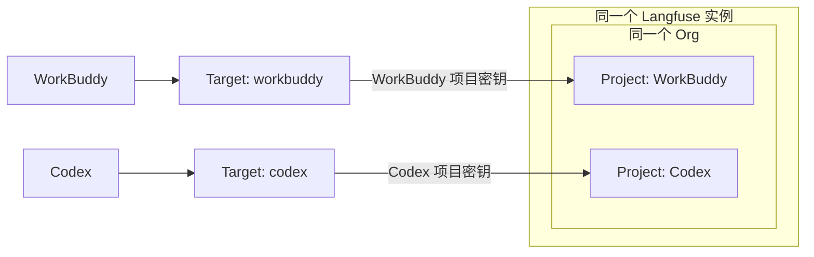

# 上报目标与数据隔离

**建议默认使用一个 Langfuse 实例、一个组织，每个 agent 一个 Project。** 这样可以统一维护服务，又能分别查看数据、管理项目密钥。helper 用 target（上报目标）保存一个实例地址及一组项目密钥，agent 选择 target 即可。

## 如何选择

| 方案 | 适合情况 | 需要理解的边界 |
|---|---|---|
| 同实例、同 Org、不同 Project | 同一团队管理 WorkBuddy、Codex，分别查看数据；推荐默认 | Project 是逻辑隔离，仍共享实例资源；组织成员权限可能继承 |
| 同实例、同 Project | 希望在同一项目中比较不同 agent | 共用项目凭证和访问范围，通过 agent 标签与 Session 标识区分 |
| 同实例、不同 Org | 团队或管理归属不同 | Org 不是独立部署，仍共享实例与底层运维边界 |
| 不同实例 | 需要独立网络、管理员、升级周期、资源或数据地域 | 运维与升级成本更高；实例独立本身也不能替代正确的访问控制 |

Langfuse 的项目密钥绑定 Project；Org 负责组织管理，不作为每次上报时填写的路由字段。实例中的 Project 隔离是逻辑边界，相关说明见 [数据隔离](https://langfuse.com/security/data-isolation) 和 [部署策略](https://langfuse.com/self-hosting/security/deployment-strategies)。组织角色与项目访问权限需要结合当前部署版本核对，见 [RBAC](https://langfuse.com/docs/administration/rbac)。

## 三种配置都用同一套命令

分别执行 `langfuse-helper workbuddy configure` 和 `langfuse-helper codex configure`。

- **分 Project**：为 WorkBuddy 创建 `workbuddy` target。配置 Codex 时选择 `Create a new target`，保留实例地址，填入 Codex Project 的新密钥。
- **共用 Project**：配置 Codex 时直接选择已有 `workbuddy` target。
- **独立实例**：为 Codex 创建新 target，并填写另一个实例的 URL 与密钥。

上图表示推荐方案；把两个 agent 绑定到同一个 target 就是共用 Project，把某个 target 的地址设为另一个实例就是独立部署。

## 切换与密钥轮换

已有 target 的 URL 与实际 Project ID 固定。更换目标必须创建新名称；轮换同项目密钥可以选择原 target 后更新。多个 agent 共用 target 时，更新该 target 的密钥会影响这些 agent；重新启动 WorkBuddy 以更新它的运行快照。

发送记录按 `agent + URL + 实际 Project ID` 隔离，不按别名或密钥隔离。因此给相同项目换别名或轮换密钥不会开启空账本；同项目下 WorkBuddy 与 Codex 的记录仍独立。

WorkBuddy 切换目标时先退出应用，向导停止原服务，原队列留在原目录。Codex 已绑定任务拒绝跨目标发送；切换后新建任务，或选回原目标继续旧任务。不要通过删账本强行重放。

[接入指南](getting-started.md) · [架构图](../architecture/overview.md)
